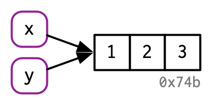

# 对象名与对象值 {#name-and-value}

```{r, include = FALSE}
source("common.R")
```

## 概述

在R中，了解对象与其名称之间的区别非常重要，这样可以帮助您：

- 更准确地预测代码的性能和内存使用情况。
- 通过避免意外复制来编写更快的代码，这是慢代码的主要来源。
- 更好地理解 R 的函数式编程工具。

本章的目标是帮助您理解对象名称和值之间的区别，以及 R 何时复制对象。

### 测验 {-}

回答以下问题，看看您是否可以通过本章。 您可以在本章末尾的第 \@ref(name-and-value-answers) 节中找到答案。

1. 给定以下数据框，如何创建一个名为“3”的新列，其中包含 `1` 和 `2` 的总和？ 您只能使用 `$`，而不能使用 `[[`。 是什么让 `1`、`2` 和 `3` 作为变量名具有挑战性？

```{r}
df <- data.frame(runif(3), runif(3))
names(df) <- c(1, 2)
```

2. 在下列代码中，`y`占据了多少内存？
```{r}
x <- runif(1e6)
y <- list(x, x, x)
```

3. 在下面的例子中，变量`a`在哪一行被复制？
```{r}
a <- c(1, 5, 3, 2)
b <- a
b[[1]] <- 10
```

### 题纲 {-}

- 第 \@ref(binding-basics) 节向您介绍了名称和值之间的区别，并讨论了 `<-` 如何在名称和值之间创建绑定或引用。
- 第 \@ref(copy-on-modify) 节描述了 R 何时进行复制：每当您修改向量时，几乎肯定会创建一个新的、修改过的向量。您将学习如何使用 `tracemem()` 来确定复制实际发生的时间。然后，您将探索这一能力在函数调用、列表、数据框和字符向量中的具体实现。
- 第 \@ref(object-size) 节探讨了前两节所涉及的对象占用内存量的一些深入问题。 由于您的直觉可能非常错误，并且 `utils::object.size()`这个方法计算出的结果也不准确，所以您将学习如何使用 `lobstr::obj_size()`得到正确的结果。
- 第 \@ref(modify-on-place) 节描述了修改时复制的两个重要例外：对于具有单一名称的环境和值，对象实际上是在原地修改的。
- 第 \@ref(gc) 节以讨论垃圾收集器结束本章，它释放不再被名称引用的对象所使用的内存。

### 先决条件 {-}

我们将使用`lobstr`包深入研究R对象的内部实现。
```{r setup}
library(lobstr)
```

### 资源 {-}

R内存管理的细节知识并没有记录在某一篇文档里。本章中的大部分信息都是通过仔细阅读各类文档（特别是通过`?Memory`和`?gc`来查看）、编写 _R扩展_ [@r-exts]的[内存分析](http://cran.r-project.org/doc/manuals/R-exts.html#Profiling-R-code-for-memory-use)部分和编写 _R internals_[@r-ints] 的[SEXPs](http://cran.r-project.org/doc/manuals/R-ints.html#SEXPs)部分收集而来的。其余的知识我是通过阅读C源代码、进行小实验以及在R-devel上提问来掌握的。文中的任何错误都是由我造成的。

## 数据绑定基础 {#binding-basics}

考虑下列代码：

```{r bind1}
x <- c(1, 2, 3)
```

这句代码很容易被理解为：创建了一个名为'x'的对象，其中包含1，2，3三个值。很不幸，这种简化的表述会造成我们对R在背后所做的事情理解不深，更确切的说，这段代码做了两件事情：

- 创建了一个值向量的对象，`c(1, 2, 3)`
- 将这个对象绑定在一个对象名`x`上

换句话说，创建一个对象或者对象的值，本身是没有名称的；而对象名称往往都绑定了一个值在上面。

为了进一步讲述这两者之间的区别，我绘制了如下图表：

```{r, echo = FALSE, out.width = NULL}
knitr::include_graphics("diagrams/name-and-value/binding-1.png")
```

x代表对象名，被一个圆角矩形包裹，它有一个箭头指向（绑定或引用）对象值，即向量c(1, 2, 3)。箭头的方向与赋值号相反：`<-`创建了一个右侧的对象值与左侧的对象名之间的绑定

因此，可以将名称视为对值的引用。例如，如果运行下列代码，将不会获得对象c(1, 2, 3)的另一个副本，而是获得现有对象的另一个绑定。

```{r bind2, dependson = 'bind1'}
y <- x
```
```{r, echo = FALSE, out.width = NULL}

```

您可能已经注意到，`c(1, 2, 3)`有一个标签`0x74b`，虽然向量没有名称，但我偶尔也需要不依赖名称而直接使用对象。为了实现这一点，通常我使用唯一标识符标记对象值。这些标识符有一种特殊的形式，看起来像对象的内存“地址”，即对象在内存中存储的位置。但是因为每次运行代码时实际的内存地址都会发生变化，所以我们使用这些标识符来代替。

可以使用`lobstr::obj_addr()`访问对象标识符，这样您可以看到`x`和`y`都指向相同的标识符。
```{r bind3, dependson = 'bind2'}
obj_addr(x)
obj_addr(y)
```

这些标识符很长，每次重启R的时候都会发生变化。

了解对象名称和值之间的区别可能需要一些时间，但是理解这一点对于函数式编程非常有用，因为函数在不同的上下文中可以有不同的名称。

### 命名规则 {#non-syntactic}

R对于对象的命名规则有着严格的规定，**合法的名称** 必须由字母[^letters]、数字、`.`和`_`构成，但不能以`_`和数字开头。此外，您不能使用任何**保留字**，如`TRUE`，`NULL`，`if`，`function`（通过`?Reserved`查看详细列表）。不遵循这些命名规则的名称是非法名称，如果您尝试使用它们，系统将报错。

```{r, eval = FALSE}
_abc <- 1
#> Error: unexpected input in "_"
if <- 10
#> Error: unexpected assignment in "if <-"
```

[^letters]: 另人惊讶的是，字母的组成取决于您计算机的语言环境，这意味着R代码可以在不同计算机上有所不同，而且在一台计算机上工作的文件甚至不能在另一台计算机上解析。应通过尽可能多地使用ASCII字符（即A-Z）来避免这个问题。

通过为对象名增加反引号，可以破除上述命名规则，使用任何对象名。

```{r}
`_abc` <- 1
`_abc`
`if` <- 10
`if`
```

虽然您不太可能故意创建这些疯狂的名称，但您需要了解这些疯狂的名称是如何工作的，因为您会遇到它们，最常见的情况是在加载在R之外创建的数据时。

:::sidebar
您也可以使用单引号或双引号（例如`“_abc” <- 1`）而不是反引号来创建非语法的对象名，但您不应该这样做，因为您可能会使用不同的语法来获取对象值，况且赋值箭头的左侧使用字符串的能力是一个在反引号出现之前的历史产物。
:::

### 习题

1. 请解释下列代码中`a`, `b`, `c`, `d`之间的关系。

```{r}
a <- 1:10
b <- a
c <- b
d <- 1:10
```

2. 下面的代码以多种方式访问`mean`函数。它们是否都指向相同的底层函数对象？用`lobstr::obj_addr()`验证这一点。

```{r, eval = FALSE}
mean
base::mean
get("mean")
evalq(mean)
match.fun("mean")

```

3. 默认情况下，base R中的数据导入函数（如`read.csv()`）将自动将非法名称转换为合法名称。为什么这可能会带来问题？什么选项允许您抑制这种行为？

4. `make.names()`使用什么规则将非法名称转换为合法名称？

5. 我稍微简化了命名规则。为什么`.123e1`不是一个合法名称？详细信息请阅读`?make.names`。

## 修改时复制（Copy-on-modify）{#copy-on-modify}


## 对象大小 {#object-size}

## 原地修改（Modify-on-place）{#modify-on-place}

## 数据解绑与垃圾收集 {#gc}

## 测试题答案 {#name-and-value-answers}
