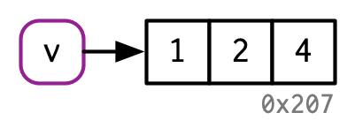

# 对象名与对象值 {#name-and-value}


## 概述

在R中，了解对象与其名称之间的区别非常重要，这样可以帮助您：

- 更准确地预测代码的性能和内存使用情况。
- 通过避免意外复制来编写更快的代码，这是慢代码的主要来源。
- 更好地理解 R 的函数式编程工具。

本章的目标是帮助您理解对象名称和值之间的区别，以及 R 何时复制对象。

### 测试 {-}

回答以下问题，看看您是否可以通过本章。您可以在本章末尾的第 \@ref(name-and-value-answers) 节中找到答案。

1. 给定以下数据框，如何创建一个名为“3”的新列，其中包含 `1` 和 `2` 的总和？ 您只能使用 `$`，而不能使用 `[[`。 是什么让 `1`、`2` 和 `3` 无法直接作为变量名？


```r
df <- data.frame(runif(3), runif(3))
names(df) <- c(1, 2)
```

2. 在下列代码中，`y`占据了多少内存？

```r
x <- runif(1e6)
y <- list(x, x, x)
```

3. 在下面的例子中，变量`a`在哪一行被复制？

```r
a <- c(1, 5, 3, 2)
b <- a
b[[1]] <- 10
```

### 题纲 {-}

- 第 \@ref(binding-basics) 节向您介绍了名称和值之间的区别，并讨论了 `<-` 如何在名称和值之间创建绑定或引用。
- 第 \@ref(copy-on-modify) 节描述了 R 何时进行复制：每当您修改向量时，几乎肯定会创建一个新的、修改过的向量。您将学习如何使用 `tracemem()` 来确定复制实际发生的时间。然后，您将探索这一能力在函数调用、列表、数据框和字符向量中的具体实现。
- 第 \@ref(object-size) 节探讨了前两节所涉及的对象占用内存量的一些深入问题。 由于您的直觉可能非常错误，并且 `utils::object.size()`这个方法计算出的结果也不准确，所以您将学习如何使用 `lobstr::obj_size()`得到正确的结果。
- 第 \@ref(modify-on-place) 节描述了修改时复制的两个重要例外：对于具有单一名称的环境和值，对象实际上是在原地修改的。
- 第 \@ref(gc) 节以讨论垃圾收集器结束本章，它释放不再被名称引用的对象所使用的内存。

### 先决条件 {-}

我们将使用`lobstr`包深入研究R对象的内部实现。

```r
library(lobstr)
```

### 资源 {-}

R内存管理的细节知识并没有记录在某一篇文档里。本章中的大部分信息都是通过仔细阅读各类文档（特别是通过`?Memory`和`?gc`来查看）、编写 _R扩展_ [@r-exts]的[内存分析](http://cran.r-project.org/doc/manuals/R-exts.html#Profiling-R-code-for-memory-use)部分和编写 _R internals_[@r-ints] 的[SEXPs](http://cran.r-project.org/doc/manuals/R-ints.html#SEXPs)部分收集而来的。其余的知识我是通过阅读C源代码、进行小实验以及在R-devel上提问来掌握的。文中的任何错误都是由我造成的。

## 数据绑定基础 {#binding-basics}

考虑下列代码：


```r
x <- c(1, 2, 3)
```

这句代码很容易被理解为：创建了一个名为'x'的对象，其中包含1，2，3三个值。很不幸，这种简化的表述会造成我们对R在背后所做的事情理解不深，更确切的说，这段代码做了两件事情：

- 创建了一个值向量的对象，`c(1, 2, 3)`
- 将这个对象绑定在一个对象名`x`上

换句话说，创建一个对象或者对象的值，本身是没有名称的；而对象名称往往都绑定了一个值在上面。

为了进一步讲述这两者之间的区别，我绘制了如下图表：


x代表对象名，被一个圆角矩形包裹，它有一个箭头指向（绑定或引用）对象值，即向量c(1, 2, 3)。箭头的方向与赋值号相反：`<-`创建了一个右侧的对象值与左侧的对象名之间的绑定

因此，可以将名称视为对值的引用。例如，如果运行下列代码，将不会获得对象c(1, 2, 3)的另一个副本，而是获得现有对象的另一个绑定。


```r
y <- x
```


您可能已经注意到，`c(1, 2, 3)`有一个标签`0x74b`，虽然向量没有名称，但我偶尔也需要不依赖名称而直接使用对象。为了实现这一点，通常我使用唯一标识符标记对象值。这些标识符有一种特殊的形式，看起来像对象的内存“地址”，即对象在内存中存储的位置。但是因为每次运行代码时实际的内存地址都会发生变化，所以我们使用这些标识符来代替。

可以使用`lobstr::obj_addr()`访问对象标识符，这样您可以看到`x`和`y`都指向相同的标识符。

```r
obj_addr(x)
#> [1] "0x43663e8"
obj_addr(y)
#> [1] "0x43663e8"
```

这些标识符很长，每次重启R的时候都会发生变化。

了解对象名称和值之间的区别可能需要一些时间，但是理解这一点对于函数式编程非常有用，因为函数在不同的上下文中可以有不同的名称。

### 命名规则 {#non-syntactic}

R对于对象的命名规则有着严格的规定，**合法的名称** 必须由字母[^letters]、数字、`.`和`_`构成，但不能以`_`和数字开头。此外，您不能使用任何**保留字**，如`TRUE`，`NULL`，`if`，`function`（通过`?Reserved`查看详细列表）。不遵循这些命名规则的名称是非法名称，如果您尝试使用它们，系统将报错。


```r
_abc <- 1
#> Error: unexpected input in "_"
if <- 10
#> Error: unexpected assignment in "if <-"
```

[^letters]: 另人惊讶的是，字母的组成取决于您计算机的语言环境，这意味着R代码可以在不同计算机上有所不同，而且在一台计算机上工作的文件甚至不能在另一台计算机上解析。应通过尽可能多地使用ASCII字符（即A-Z）来避免这个问题。

通过为对象名增加反引号，可以破除上述命名规则，使用任何对象名。


```r
`_abc` <- 1
`_abc`
#> [1] 1
`if` <- 10
`if`
#> [1] 10
```

虽然您不太可能故意创建这些疯狂的名称，但您需要了解这些疯狂的名称是如何工作的，因为您会遇到它们，最常见的情况是在加载在R之外创建的数据时。

:::sidebar
您也可以使用单引号或双引号（例如`“_abc” <- 1`）而不是反引号来创建非语法的对象名，但您不应该这样做，因为您可能会使用不同的语法来获取对象值，况且赋值箭头的左侧使用字符串的能力是一个在反引号出现之前的历史产物。
:::

### 习题

1. 请解释下列代码中`a`, `b`, `c`, `d`之间的关系。


```r
a <- 1:10
b <- a
c <- b
d <- 1:10
```

2. 下面的代码以多种方式访问`mean`函数。它们是否都指向相同的底层函数对象？用`lobstr::obj_addr()`验证这一点。


```r
mean
base::mean
get("mean")
evalq(mean)
match.fun("mean")

```

3. 默认情况下，base R中的数据导入函数（如`read.csv()`）将自动将非法名称转换为合法名称。为什么这可能会带来问题？什么选项允许您抑制这种行为？

4. `make.names()`使用什么规则将非法名称转换为合法名称？

5. 我稍微简化了命名规则。为什么`.123e1`不是一个合法名称？详细信息请阅读`?make.names`。

## 修改时复制（Copy-on-modify）{#copy-on-modify}

考虑下面的代码，它将`x`和`y`绑定到相同的基础对象值，然后再修改`y`[^double-bracket]。

[^double-bracket]: 您可能会惊讶的看到`[[`符号可以用于获取向量的子集，我们会在\@ref(subset-single)章节详细讨论这个问题，现在您只需要使用`[[`去获取或者设置单个元素值就好。


```r
x <- c(1, 2, 3)
y <- x
y[[3]] <- 4
x
#> [1] 1 2 3
```

修改`y`显然没有修改`x`，但`x`与`y`绑定了同一个对象，那么修改到底发生了什么？虽然与`y`关联的值发生了变化，但原始对象没有发生变化，相反，R创建了一个新对象`0xcd2`，它是`0x74b`对象的副本，将它的值发生改变后重新绑定至`y`。


这种行为被称作**修改时复制**，理解它会从根本上提高您对R代码的感觉，通常我们会把这种行为描述为R对象是**不可变的**，但是我通常会避免使用该术语，因为修改时复制的特性有几个非常重要的例外，我将在第\@ref(modify-on-place)节中介绍。

当以交互方式探索“修改时复制”的行为时，请注意您将在 RStudio 中获得不同的结果，那是因为环境面板必须引用每个对象才能显示有关它的信息。这会让您对交互式探索产生误判，但不会影响函数内部的代码，因此不会影响数据分析期间的性能。对于实验，我建议直接从终端运行 R，或者使用 RMarkdown（就像本书一样）。

### `tracemem()` {#tracemem}

您可以使用`base::tracemem()`函数查看对象何时被复制，一旦您用一个对象调用这个函数，您会得到这个对象的当前地址：


```r
x <- c(1, 2, 3)
cat(tracemem(x), "\n")
#> <0x7f80c0e0ffc8>
```

从这时起，无论何时复制该对象，`tracemem()` 都会打印一条消息，告诉您复制了哪个对象、它的新地址以及修改时复制的调用序列：


```r
y <- x
y[[3]] <- 4L
#> tracemem[0x7f80c0e0ffc8 -> 0x7f80c4427f40]: 
```

如果您再次修改`y`，它将不会被复制。这是因为新对象现在只有一个绑定到它的对象名，所以R使用了**原地修改**进行优化，我们将在\@ref(modify-on-place)节中详细讨论。


```r
y[[3]] <- 5L

untracemem(x)
```

`untracemem()`与`tracemem()`相反，它关闭对对象的追踪。

### 函数调用

修改时复制的相关规则也适用于函数调用，以下列代码为例：


```r
f <- function(a) {
  a
}

x <- c(1, 2, 3)
cat(tracemem(x), "\n")
#> <0x72ab6b8>

z <- f(x)
# there's no copy here!

untracemem(x)
```
当`f()`运行时，函数内部的变量名`a`与函数外部变量名`x`指向相同的值：


您将在\@ref(execution-environment)节了解更多关于上图的相关知识。简而言之，函数`f()`由右侧的黄色对象表示，它有一个形参`a`，当函数运行时，它成为执行环境（灰色矩形框）中的绑定（由黑色虚线表示）。

一旦`f()`运行完毕，`x`和`z`将指向同一个对象，由于`0x74b`没有被修改，所以它不会被复制，如果`f()`确实修改了`x`，那么R将创建一个新副本，然后`z`将绑定该对象。


### 列表 {#lists}

变量名不只能指向向量值，也能指向列表，它与上面的向量非常相似：


```r
l1 <- list(1, 2, 3)
```

列表更为复杂，因为它不是存储值的本身，而是存储它们的引用。


这对于修改列表时非常重要：


```r
l2 <- l1
```


```r
l2[[3]] <- 4
```


与向量类似，列表也有修改时复制的特性；原始列表保持不变，R创建一个修改后的副本。然而，这是一个**浅拷贝**：即列表对象及其绑定被复制，但绑定的值没有被复制。与浅拷贝相反的是深拷贝，即每个引用的内容都被复制。在R 3.1.0版本之前，所有的拷贝都是深拷贝。

要查看跨列表的共享值，请使用`lobstr::ref()`函数。`ref()`打印每个对象的内存地址及本地ID，以便您可以轻松发现跨列表的引用值。


```r
ref(l1, l2)
#> █ [1:0x4217278] <list> 
#> ├─[2:0x49ee9f0] <dbl> 
#> ├─[3:0x49ee9b8] <dbl> 
#> └─[4:0x49ee980] <dbl> 
#>  
#> █ [5:0x72c2548] <list> 
#> ├─[2:0x49ee9f0] 
#> ├─[3:0x49ee9b8] 
#> └─[6:0x75e20e0] <dbl>
```

### 数据框

数据框是向量列表，因此在修改数据框时，修改时复制的特性会产生重要影响。以这个数据框为例：


```r
d1 <- data.frame(x = c(1, 5, 6), y = c(2, 4, 3))
```


如果修改了一列，只有*那一列*发生了修改时复制，其他列仍将指向其原始的引用：


```r
d2 <- d1
d2[, 2] <- d2[, 2] * 2
```


如果修改了一行，每列值都被修改，这就意味着每列值被发生了修改时复制：


```r
d3 <- d1
d3[1, ] <- d3[1, ] * 3
```


### 字符向量

R语言最后一个使用引用的地方是字符向量[^character-vector]，我通常用如下的方式表达字符向量：


```r
x <- c("a", "a", "abc", "d")
```


[^character-vector]: 字符向量其实是字符串向量，不只是单个字符。

但这只是示意，事实上R使用一个**全局字符串池**，字符向量中的每个元素都是指向池中唯一字符串的指针:


您可通过调用`character`参数设置为`TRUE`的`ref()`函数来显示这些引用。


```r
ref(x, character = TRUE)
#> █ [1:0x71c0af8] <chr> 
#> ├─[2:0x10b3e20] <string: "a"> 
#> ├─[2:0x10b3e20] 
#> ├─[3:0x8558770] <string: "abc"> 
#> └─[4:0x1274688] <string: "d">
```

这种设计对于字符向量使用的内存量有很大的影响，但在其它方面无关紧要，因此在本书的后续章节，我在画图的时候依然会把字符串画在向量内部。

### 习题

1. 为什么运行`tracemem(1:10)`没有意义？

2. 解释一下为何下列代码运行`tracemem(x)`后出现两条拷贝信息？提示：认真查看这个代码与前面章节中的代码不同之处。


```r
x <- c(1L, 2L, 3L)
tracemem(x)

x[3] <- 4
```

3. 绘制以下对象之间的关系图。


```r
a <- 1:10
b <- list(a, a)
c <- list(b, a, 1:10)
```

4. 当运行下列代码时，会发生什么？


```r
x <- list(1:10)
x[[2]] <- x
```

## 对象大小 {#object-size}

您可以通过`lobstr::obj_size()`[^object.size]函数查看一个对象占用了多少内存。


```r
obj_size(letters)
#> 1,712 B
obj_size(ggplot2::diamonds)
#> 3,456,344 B
```

[^object.size]: 请注意`utils::object.size()`函数，它没有考虑共享引用，将导致返回值过大。

由于列表的元素是对值的引用，因此列表的大小可能比您预期小的多：


```r
x <- runif(1e6)
obj_size(x)
#> 8,000,048 B

y <- list(x, x, x)
obj_size(y)
#> 8,000,128 B
```

`y`只比`x`大80个字节[^32bit]，这是一个包含三个元素的空列表的大小：


```r
obj_size(list(NULL, NULL, NULL))
#> 80 B
```

[^32bit]: 如果您运行的是32位的R，您看到的大小将有所不同。

类似的,因为R使用全局字符串池，所以字符向量占用的内存比您预期的少：重复字符串100次并不会使它占用100倍的内存。


```r
banana <- "bananas bananas bananas"
obj_size(banana)
#> 136 B

obj_size(rep(banana, 100))
#> 928 B
```

引用的存在使得估计单个对象的大小变得比较困难，如果没有共享值，`obj_size(x)` + `obj_size(y)`将等于`obj_size(x, y)`，如下列代码所示，`x`与`y`组合的大小等于`y`单独的大小。


```r
obj_size(x, y)
#> 8,000,128 B
```

最后，R 3.5.0之后的版本提供了一个令人兴奋的能力：ALTREP，即**替代形式(alternative representation)**。这种特性允许R采用`:`这种非常紧凑的方式表示向量，这种方式用存储向量的起始值与结束值代替存储每个值，这意味着不论您的向量有多少个值，它都拥有相同的大小。


```r
obj_size(1:3)
#> 680 B
obj_size(1:1e3)
#> 680 B
obj_size(1:1e6)
#> 680 B
obj_size(1:1e9)
#> 680 B
```

### 习题

1. 在下面的例子中，为何`object.size()`与`object_size()`的结果有巨大的差异？请阅读`object_size()`的文档寻找答案。


```r
y <- rep(list(runif(1e4)), 100)

object.size(y)
#> 8005648 bytes

object.size(y)
#> 8005648 bytes
```

2. 以下面的列表为例，为什么它的大小与想的不一样？


```r
funs <- list(mean, sd, var)
obj_size(funs)
#> 17,608 B
```

3. 预测以下代码的输出结果。


```r
a <- runif(1e6)
obj_size(a)

b <- list(a, a)
obj_size(b)
obj_size(a, b)

b[[1]][[1]] <- 10
obj_size(b)
obj_size(a, b)

b[[2]][[1]] <- 10
obj_size(b)
obj_size(a, b)
```

## 原地修改（Modify-on-place）{#modify-on-place}

正如我们在上面看到的那样，修改R对象通常会创建一个副本，但这里有两个例外：

- 单一绑定对象可获得特殊的性能优化。
- 环境是一种特殊类型的对象，它总是在原地修改。

### 单一绑定对象 {#single-binding}

如果对象只被一个对象名绑定，R将原地修改这个变量：


```r
v <- c(1, 2, 3)
```


```r
v[[3]] <- 4
```



（请注意对象ID：`v`始终绑定在同一对象上，`0x207`。）

有两个复杂因素使得预测R何时开展性能优化变得有难度：

- 说到绑定，R目前只能按0，1或多个来计数。这就意味着，假如一个对象拥有2个绑定，当一个消失时，引用计数不会回到1：多个减去1还等于多个。反过来就说明R有时会在不需要的时候进行复制。

- 当您调用绝大多数函数的时候，它都会为对象创建引用，唯一的例外是专门编写的“原始”C函数。这些只能由R的核心开发团队编写，并且主要出现在base包中。

总之，这两种复杂的情况使得预测是否会产生副本变得很难，因此用`tracemem()`函数来判断是很好的经验。

让我们通过使用for循环的案例研究来探索其中的微妙之处，for循环在R中是比较慢的，这种慢通常是由于循环的每次迭代都会创建一直副本造成的。考虑下面的代码，经从一个大型数据框的每一列减去一个值：


```r
x <- data.frame(matrix(runif(5 * 1e4), ncol = 5))
medians <- vapply(x, median, numeric(1))

for (i in seq_along(medians)) {
  x[[i]] <- x[[i]] - medians[[i]]
}
```

这个循环运行的非常慢，因为每次迭代都会复制数据框，您可以使用`tracemem()`函数来监控运行：


```r
cat(tracemem(x), "\n")
#> <0x7f80c429e020> 

for (i in 1:5) {
  x[[i]] <- x[[i]] - medians[[i]]
}
#> tracemem[0x7f80c429e020 -> 0x7f80c0c144d8]: 
#> tracemem[0x7f80c0c144d8 -> 0x7f80c0c14540]: [[<-.data.frame [[<- 
#> tracemem[0x7f80c0c14540 -> 0x7f80c0c145a8]: [[<-.data.frame [[<- 
#> tracemem[0x7f80c0c145a8 -> 0x7f80c0c14610]: 
#> tracemem[0x7f80c0c14610 -> 0x7f80c0c14678]: [[<-.data.frame [[<- 
#> tracemem[0x7f80c0c14678 -> 0x7f80c0c146e0]: [[<-.data.frame [[<- 
#> tracemem[0x7f80c0c146e0 -> 0x7f80c0c14748]: 
#> tracemem[0x7f80c0c14748 -> 0x7f80c0c147b0]: [[<-.data.frame [[<- 
#> tracemem[0x7f80c0c147b0 -> 0x7f80c0c14818]: [[<-.data.frame [[<- 
#> tracemem[0x7f80c0c14818 -> 0x7f80c0c14880]: 
#> tracemem[0x7f80c0c14880 -> 0x7f80c0c148e8]: [[<-.data.frame [[<- 
#> tracemem[0x7f80c0c148e8 -> 0x7f80c0c14950]: [[<-.data.frame [[<- 
#> tracemem[0x7f80c0c14950 -> 0x7f80c0c149b8]: 
#> tracemem[0x7f80c0c149b8 -> 0x7f80c0c14a20]: [[<-.data.frame [[<- 
#> tracemem[0x7f80c0c14a20 -> 0x7f80c0c14a88]: [[<-.data.frame [[<- 

untracemem(x)
```

事实上，每次迭代不止复制的一次数据框，也不止是两次，而是三次。`[[.data.frame`先生成了两个副本，然后又生成了一个[^shallow-copy]，因为`[[.data.frame`是一个常规函数，它会增加`x`的引用计数。

[^shallow-copy]: 这些都是浅拷贝，它们只是复制了每个列的引用，而不是列的内容，其实性能没有那么差，但也不是最好的方法。

我们可以通过使用列表而不是数据框来减少副本复制的数量，修改列表使用的是内部C函数，因此不会增加引用计数，只生成一个副本：


```r
y <- as.list(x)
cat(tracemem(y), "\n")
#> <0x7f80c5c3de20>
  
for (i in 1:5) {
  y[[i]] <- y[[i]] - medians[[i]]
}
#> tracemem[0x7f80c5c3de20 -> 0x7f80c48de210]: 
```

虽然不难发现何时产生了副本，但却很难阻止它。如果您发现自己在使用一些奇异的技巧避免产生复制，那可能是时候用C++重写您的函数了，这些内容我们将在第\@ref(rewriting)章中讲述。

### 环境 {#env-modify}

您将在第\@ref(environments)章学习更多与环境相关的知识，但在这里提及它们十分重要，因为它们的行为与其它对象的行为不同：环境总是在适当的地方进行修改。这种属性有时被成为**引用语义**，因为当您修改环境时，所有这个环境中的所有绑定将继续保持相同的引用。

如同下列这个绑定到`e1`和`e2`的环境：


```r
e1 <- rlang::env(a = 1, b = 2, c = 3)
e2 <- e1
```


如果我们改变了绑定，环境也就地修改。


```r
e1$c <- 4
e2$c
#> [1] 4
```


这个特性可以用于创建“可记住”先前状态的函数，更多的信息请见\@ref(function-environments)。这个特性实现了R6面向对象系统，这将在第\@ref(r6)章详细介绍。

这样做的一个重要结果是环境可以包含自己：


```r
e <- rlang::env()
e$self <- e

ref(e)
#> █ [1:0x5916dd8] <env> 
#> └─self = [1:0x5916dd8]
```


这是环境对象唯一的属性。

### 习题

1. 解释一下为何下列代码没有创建一个循环列表


```r
x <- list()
x[[1]] <- x
```

2. 将上述两个减中位数的方法包装成两个函数，调用`bench`包比较两个方法的速度。随着列数增加，性能如何变化？

3. 如果您尝试在环境中使用`tracemem()`函数会发生什么？

## 对象解绑与垃圾收集 {#gc}

考虑下列代码：


```r
x <- 1:3
```


```r
x <- 2:4
```


```r
rm(x)
```


我们创建了两个对象，但等到代码运行完毕后，没有一个对象绑定到了对象名。这些对象如何被删除？这个工作交给了**垃圾收集器**，简称GC。GC释放那些已经被删除的对象所占用的内存，并在需要时从操作系统请求更多内存。

R使用**追踪式**垃圾收集器，这意味着它会跟踪可以从全局环境[^callstack]访问的每个对象，以及可从这些对象上访问的所有对象（即可递归搜索的列表与环境中的引用）。垃圾收集器不使用上述原地修改引用计数，虽然垃圾收集器与引用计数是密切相关的，但内部数据结构针对不同用例进行了优化。

[^callstack]: 以及当前调用堆栈上的每个环境。

每个R需要更多内存来创建新对象时，垃圾收集器(GC)就会自动运行，从外部来看，基本上没法预测GC何时运行。事实上，你也不应该尝试预测。如果您想知道GC何时运行，请调用`gcinfo(TRUE)`，GC将在每次运行时向控制台打印一条消息。

可以通过调用`gc()`函数来强制垃圾收集，这一点您可以已经在其它地方有所了解，但您永远不需要这么做。调用`gc()`的唯一原因可能是要求R将内存返回到操作系统，以便其他程序可以使用它，或者是告诉您当前使用了多少内存，这其实是一个额外的作用：


```r
gc()
#>           used (Mb) gc trigger  (Mb) max used  (Mb)
#> Ncells  855070 45.7    1645301  87.9  1645301  87.9
#> Vcells 4962720 37.9   17010142 129.8 17009272 129.8
```

`lobstr::mem_used()`函数是`gc()`的包装器，用于打印使用字节的总数：


```r
mem_used()
#> 87,591,776 B
```

这个数字与您操作系统显示的可能不一样，主要是由下列三个原因造成的：

1. 它包括由R创建的对象，但不包括由R解释器创建的对象。

2. R和操作系统都是惰性的：它们都是到了真正需要的时候才会回收内存。因此R可能会占用内存，因为操作系统还未要求它返回。

3. R统计对象占用的内存，但可能会因为删除的对象而存在空白。这个问题称为内存碎片化。

## 测试题答案 {#name-and-value-answers}

1. 你必须使用反引号`` ` ``引用非法名称：例如，例如变量`1`, `2`, `3`。

```r
df <- data.frame(runif(3), runif(3))
names(df) <- c(1, 2)

df$`3` <- df$`1` + df$`2`
```

2. 它大约占用8Mb。

```r
x <- runif(1e6)
y <- list(x, x, x)
obj_size(y)
#> 8,000,128 B
```

3. 当`b`发生修改时，`a`会复制。即在`b[[1]] <- 10`这一行发生复制。
