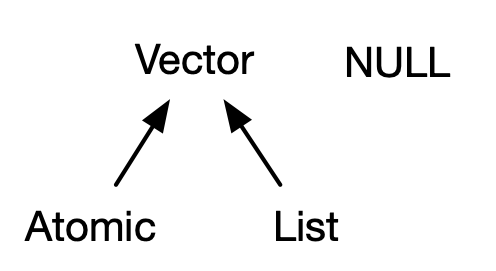

# 向量 {#vectors}

```{r setup, include = FALSE}
source("common.R")
```

## 概述

本章讨论R基础包中最重要的数据结构：向量[^node]。虽然您可能已经使用了许多（如果不是全部）不同类型的向量，但您可能没有深入思考它们之间的相互关系。在本章中，我不会过多地介绍各个向量类型，但我会向您展示所有类型如何组合在一起。如果您需要更多详细信息，可以在R的文档中找到它们。

[^node]: 总的来说，所有其他数据类型都称为“节点”类型，其中包括函数和环境等。在使用 `gc()` 时，您最有可能遇到这个技术性很强的术语：`Ncells` 中的“N”代表节点，而`Vcells`中的“V”代表向量。

向量有两种形式：原子向量和列表[^generic-vector]。它们的元素类型不同：对于原子向量，所有元素必须具有相同的类型； 对于列表，元素可以有不同的类型。虽然不是向量，但`NULL`与向量密切相关，并且通常充当通用零长度向量的角色。我们将在本章中不断扩展这张图来说明向量间的基本关系：

```{r, echo = FALSE, out.width = NULL}

```

[^generic-vector]: R文档的一些地方把列表称为通用向量，以强调它们与原子向量的区别。

每个向量还可以具有属性，可以将其视为任意元数据的命名列表，有两个**属性**非常的重要。**维度**属性将向量转化为矩阵和数组，**类别**属性为S3对象系统提供了强大的能力。虽然您将在第\@ref(s3)章中学习如何使用 S3，但在这里您将了解一些最重要的S3向量：因子、日期、时间、数据框和tibble。当您想到向量时，虽然不一定会想到矩阵和数据框等二维数据结构，但您还将了解为什么 R 将它们视为向量。

### 测试 {-}

参加这个简短的测验，以确定您是否需要阅读本章。如果很快就能想到答案，您可以轻松跳过本章。 您可以在第\@ref(vector-quiz-answer)节中检查您的答案。

1. 四种常见的原子向量类型是什么？两种罕见的类型是什么?

1. 什么是属性？你如何获取和设置它们？

1. 列表与原子向量有何不同？矩阵与数据框有何不同？

1. 你能有一个矩阵列表吗？数据框可以有一个矩阵列吗？

1. tibble与数据框的行为有何不同？

### 题纲 {-}

- 第\@ref(atomic-vector)节向您介绍了原子向量：逻辑型向量、整型向量、双精度型向量和字符型向量。 这些是 R 最简单的数据结构。

- 第\@ref(attribute)节绕道讨论属性，R 的灵活元数据规范。 最重要的属性是名称、维度和类别。

- 第\@ref(s3-atomic-vector)节讨论了通过将具有特殊属性的原子向量组合而构建的重要向量类型。 这些包括因子、日期、日期时间和持续时间

- 第\@ref(list)节深入研究列表。列表与原子向量非常相似，但有一个关键区别：列表的元素可以是任何数据类型，包括另一个列表。这使得它们适用于表示分层数据。

- 第\@ref(dataframe-and-tibble)节将教您用于表示矩形数据的数据框和tibble。它们结合了列表和矩阵的行为，非常适合统计数据的需要。

## 原子向量 {#atomic-vector}

原子向量有四种主要类型：逻辑型、整型、双精度型和字符型（包括字符串），整型向量与双精度向量统称数值向量[^numeric]。还有两种罕见的类型：复数型和原始型。我不会深入讨论它们，因为在统计学中很少需要使用复数，同时原始向量一般只有在处理二进制数据时才会使用。

```{r, echo = FALSE, out.width = NULL}
knitr::include_graphics("diagrams/vectors/summary-tree-atomic.png")
```

[^numeric]: 这是一个轻微的简化，因为R并没有始终使用“数值”这个词，我们将在\@ref(numeric-type)节中详细介绍。

### 标量 {#scalars}

四种主要类型的原子向量各有一种独特的语法来创建拥有一个值的对象，即标量[^scalar]：

- 逻辑型向量可以用完整形式表示（`TRUE`或者`FALSE`），也可以用简写表示（`T`或`F`）。

- 双精度型向量可以用十进制（`0.1234`）、科学计数法（`1.23e4`）或十六进制（`0xcafe`）来表示。双精度类型有三个由浮点标准定义的特殊值：`-Inf`，`Inf`和`NaN`（非数值）。

- 整型向量的表达方式与双精度类似，但数字后面必须跟`L`[^L-suffix]（`1234L`、`1e4L`、`0xcafeL`），并且不能包含小数。

- 字符串由单引号`'`或者双引号`"`包围，特殊字符需要匹配转义符号`\`。通过`?Quotes`查看更多信息。

[^scalar]: 从技术上讲，R语言没有标量，看起来像标量的对象其实是长度为1的向量。

[^L-suffix]: 使用`L`后缀看起来并不方便，您可能想知道为何会有这样的规范要求。向R向量中添加后缀`L`时，R的整型相当于C语言的长整型，C代码可以使用`L`或者`l`强制整数变为长整数，由于`l`在表现上比较像大写的字母`i`，容易发生混淆，因此R语言中只保留了`L`。

### 使用`c()`函数创建长向量 {#make-long-vectors}

使用`c()`函数可以把多个短向量组合成长向量：

```{r}
lgl_var <- c(TRUE, FALSE)
int_var <- c(1L, 6L, 10L)
dbl_var <- c(1, 2.5, 4.5)
chr_var <- c("these are", "some strings")
```

如果传入的是原子向量，`c()`函数也会生成一个新的原子向量，新向量会展平：

```{r}
c(c(1, 2), c(3, 4))
```

如果我将向量表达为连接的矩形，那么上面的代码可以绘制如下：

```{r, echo = FALSE, out.width = NULL}
knitr::include_graphics("diagrams/vectors/atomic.png")
```

您可以使用`typeof()`[^mode]函数确定向量的类型，使用`length()`函数确定向量的长度

```{r}
typeof(lgl_var)
typeof(int_var)
typeof(dbl_var)
typeof(chr_var)
```

[^mode]: 您可能听说过`mode()`函数和`storage.mode()`函数。不要使用它们：它们的存在只是为了与S语言兼容。

### 缺失值 {#missing-values}

### 类型判断与强制转换 {#vector-testing-and-coercion}

### 习题

## 属性 {#attribute}

### 获取属性与设置属性 {#getting-and-setting}

### 属性名 {#attr-names}

### 维度 {#dimensions}

### 习题

## S3原子向量 {#s3-atomic-vector}

### 因子型 {#factors}

### 日期型 {#dates}

### 日期时间型 {#datetimes}

### 时间间隔 {#durations}

### 习题

## 列表 {#list}

### 创建列表 {#creating-list}

### 列表判断与强制转换 {#list-testing-and-coercion}

### 矩阵和数组 {#matrices-and-array}

### 习题

## 数据框和tibble {#dataframe-and-tibble}

### 创建数据框 {#creating-df}

### 行名 {#row-names}

### 打印数据框 {#printing-df}

### 子集 {#subsetting}

### 数据框判断与强制转换 {#df-testing-and-coercion}

### 列表列 {#list-columns}

### 矩阵和数据框列 {#matrix-and-df-columns}

### 习题

## NULL {#null}

## 测试题答案 {#vector-quiz-answer}
