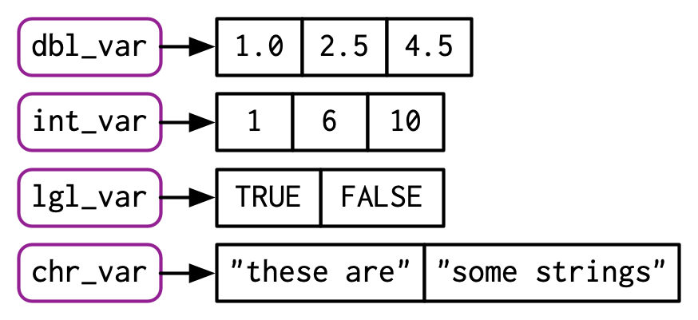
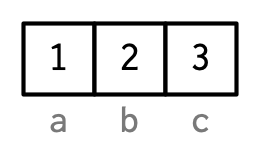
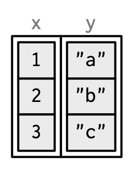

# 向量 {#vectors}

```{r setup, include = FALSE}
source("common.R")
```

## 概述

本章讨论R基础包中最重要的数据结构：向量[^node]。虽然您可能已经使用了许多（如果不是全部）不同类型的向量，但您可能没有深入思考它们之间的相互关系。在本章中，我不会过多地介绍各个向量类型，但我会向您展示所有类型如何组合在一起。如果您需要更多详细信息，可以在R的文档中找到它们。

[^node]: 总的来说，所有其他数据类型都称为“节点”类型，其中包括函数和环境等。在使用 `gc()` 时，您最有可能遇到这个技术性很强的术语：`Ncells` 中的“N”代表节点，而`Vcells`中的“V”代表向量。

向量有两种形式：原子向量和列表[^generic-vector]。它们的元素类型不同：对于原子向量，所有元素必须具有相同的类型； 对于列表，元素可以有不同的类型。虽然不是向量，但`NULL`与向量密切相关，并且通常充当通用零长度向量的角色。我们将在本章中不断扩展这张图来说明向量间的基本关系：

```{r, echo = FALSE, out.width = NULL}
knitr::include_graphics("diagrams/vectors/summary-tree.png")
```

[^generic-vector]: R文档的一些地方把列表称为通用向量，以强调它们与原子向量的区别。

每个向量还可以具有属性，可以将其视为任意元数据的命名列表，有两个**属性**非常的重要。**维度**属性将向量转化为矩阵和数组，**类别**属性为S3对象系统提供了强大的能力。虽然您将在第\@ref(s3)章中学习如何使用 S3，但在这里您将了解一些最重要的S3向量：因子、日期、时间、数据框和tibble。当您想到向量时，虽然不一定会想到矩阵和数据框等二维数据结构，但您还将了解为什么 R 将它们视为向量。

### 测试 {-}

参加这个简短的测验，以确定您是否需要阅读本章。如果很快就能想到答案，您可以轻松跳过本章。 您可以在第\@ref(vector-quiz-answer)节中检查您的答案。

1. 四种常见的原子向量类型是什么？两种罕见的类型是什么?

1. 什么是属性？你如何获取和设置它们？

1. 列表与原子向量有何不同？矩阵与数据框有何不同？

1. 你能有一个矩阵列表吗？数据框可以有一个矩阵列吗？

1. tibble与数据框的行为有何不同？

### 题纲 {-}

- 第\@ref(atomic-vector)节向您介绍了原子向量：逻辑型向量、整型向量、双精度型向量和字符型向量。 这些是 R 最简单的数据结构。

- 第\@ref(attribute)节绕道讨论属性，R 的灵活元数据规范。 最重要的属性是名称、维度和类别。

- 第\@ref(s3-atomic-vector)节讨论了通过将具有特殊属性的原子向量组合而构建的重要向量类型。 这些包括因子、日期、日期时间和持续时间

- 第\@ref(list)节深入研究列表。列表与原子向量非常相似，但有一个关键区别：列表的元素可以是任何数据类型，包括另一个列表。这使得它们适用于表示分层数据。

- 第\@ref(dataframe-and-tibble)节将教您用于表示矩形数据的数据框和tibble。它们结合了列表和矩阵的行为，非常适合统计数据的需要。

## 原子向量 {#atomic-vector}

原子向量有四种主要类型：逻辑型、整型、双精度型和字符型（包括字符串），整型向量与双精度向量统称数值向量[^numeric]。还有两种罕见的类型：复数型和原始型。我不会深入讨论它们，因为在统计学中很少需要使用复数，同时原始向量一般只有在处理二进制数据时才会使用。

```{r, echo = FALSE, out.width = NULL}
knitr::include_graphics("diagrams/vectors/summary-tree-atomic.png")
```

[^numeric]: 这是一个轻微的简化，因为R并没有始终使用“数值”这个词，我们将在\@ref(numeric-type)节中详细介绍。

### 标量 {#scalars}

四种主要类型的原子向量各有一种独特的语法来创建拥有一个值的对象，即标量[^scalar]：

- 逻辑型向量可以用完整形式表示（`TRUE`或者`FALSE`），也可以用简写表示（`T`或`F`）。

- 双精度型向量可以用十进制（`0.1234`）、科学计数法（`1.23e4`）或十六进制（`0xcafe`）来表示。双精度类型有三个由浮点标准定义的特殊值：`-Inf`，`Inf`和`NaN`（非数值）。

- 整型向量的表达方式与双精度类似，但数字后面必须跟`L`[^L-suffix]（`1234L`、`1e4L`、`0xcafeL`），并且不能包含小数。

- 字符串由单引号`'`或者双引号`"`包围，特殊字符需要匹配转义符号`\`。通过`?Quotes`查看更多信息。

[^scalar]: 从技术上讲，R语言没有标量，看起来像标量的对象其实是长度为1的向量。

[^L-suffix]: 使用`L`后缀看起来并不方便，您可能想知道为何会有这样的规范要求。向R向量中添加后缀`L`时，R的整型相当于C语言的长整型，C代码可以使用`L`或者`l`强制整数变为长整数，由于`l`在表现上比较像大写的字母`i`，容易发生混淆，因此R语言中只保留了`L`。

### 使用`c()`函数创建长向量 {#make-long-vectors}

使用`c()`函数可以把多个短向量组合成长向量：

```{r}
lgl_var <- c(TRUE, FALSE)
int_var <- c(1L, 6L, 10L)
dbl_var <- c(1, 2.5, 4.5)
chr_var <- c("these are", "some strings")
```

如果传入的是原子向量，`c()`函数也会生成一个新的原子向量，新向量会展平：

```{r}
c(c(1, 2), c(3, 4))
```

如果我将向量表达为连接的矩形，那么上面的代码可以绘制如下：

```{r, echo = FALSE, out.width = NULL}

```

您可以使用`typeof()`[^mode]函数确定向量的类型，使用`length()`函数确定向量的长度。

```{r}
typeof(lgl_var)
typeof(int_var)
typeof(dbl_var)
typeof(chr_var)
```

[^mode]: 您可能听说过`mode()`函数和`storage.mode()`函数。不要使用它们：它们的存在只是为了与S语言兼容。

### 缺失值 {#missing-values}

R使用一种特殊的标记值`NA`（Not applicable的简写）代表缺失值或未知值，缺失值往往具有传染性：大多数涉及缺失值的计算将返回另一个缺失值。

```{r}
NA > 5
10 * NA
!NA
```

这条规则只有少数例外，就是针对那些所有输入值都返回相同值的情况下。

```{r}
NA ^ 0
NA | TRUE
NA & FALSE
```

为了确定向量中哪些值是缺失的，我们往往犯一个常见的错误：

```{r}
x <- c(NA, 5, NA, 10)
x == NA
```

这个结果是正确的（虽然有点令人惊讶），因为没有理由相信一个缺失值与另一个具有相同的值。相反，如果需要判断是否存在缺失，应该使用`is.na()`函数：

```{r}
is.na(x)
```

注意：从技术上讲，每个原子类型都有自己的缺失值：`NA`（逻辑型）、`NA_integer_`（整型）、`NA_real_`（双精度型）和`NA_character_`（字符型）。这种区别通常并不重要，因为`NA`将在需要时自动强制为正确的类型。

### 类型判断与强制转换 {#vector-testing-and-coercion}

通常，您可以使用`is.*()`函数测试是否给为给定类型，但使用这类函数的时候一定要谨慎。`is.logical()`、`is.integer()`、`is.double()`和`is.character()`测试向量是否为逻辑型、整型、双精度型还是字符型向量，这也许可以满足您的需求。但请避免使用`is.vector()`, `is.atomic()`和`is.numeric()`函数：它们不能判断出是否为向量，原子向量或者数值型向量，您需要仔细阅读文档以了解它们的实际作用。

对于原子向量，类型是整个向量的一个属性：所有元素必须是同一类型。当您尝试组合不同类型时，它们将按固定顺序**强制转换**：字符 → 双精度 → 整数 → 逻辑。 例如，组合一个字符和一个整数会产生一个字符向量：

```{r}
str(c("a", 1))
```

强制转换通常会自动发生，大多数数学函数（`+`，`abs`，`log`等等）将输入值强制转换为数值型，这种强制对逻辑向量特别有用，因为 `TRUE` 转为 1，`FALSE` 转为 0。

```{r}
x <- c(FALSE, FALSE, TRUE)
as.numeric(x)

# Total number of TRUEs
sum(x)

# Proportion that are TRUE
mean(x)
```

通常，您可以使用 `as.*()`类的函数强制类型转换，例如 `as.logical()`、`as.integer()`、`as.double()` 或 `as.character()`。字符串强制转换失败会生成警告和缺失值：

```{r}
as.integer(c("1", "1.5", "a"))
```

### 习题

1. 如何创建原始型和复数型的标量？（通过`?raw`和`?complex`查看用法）

1. 预测下列向量的输出结果来测试您对于强制转换规则是否理解。
```{r, eval = FALSE}
c(1, FALSE)
c("a", 1)
c(TRUE, 1L)
```

3. 为何`1 == "1"`返回true? 为何`-1 < FALSE`返回true? 为何`"one" < 2`返回false?

4. 为什么默认的缺失值`NA`是一个逻辑向量？逻辑向量有什么特别之处？（提示：考虑 c(FALSE, NA_character_)）

5. 测试`is.atomic()`、`is.numeric()` 和 `is.vector()` 这三个函数究竟是做什么的？

## 属性 {#attribute}

您可能已经注意到，原子向量集不包括许多重要的数据结构，如矩阵、数组、因子或日期时间。 这些类型通过添加属性建立在原子向量之上。 在本节中，您将学习属性的基础知识，以及 dim 属性如何生成矩阵和数组。 在下一节中，您将了解如何使用 class 属性创建 S3 向量，包括因子、日期和日期时间。

### 获取属性与设置属性 {#getting-and-setting}

您可以将属性视为以键值对[^pairlists]形式存在的对象元数据。您可以使用`attr()`函数获取和设置单个属性，也可以使用`attributes()`函数整体获取属性，使用`structure()`整体设置属性。

```{r}
a <- 1:3
attr(a, "x") <- "abcdef"
attr(a, "x")

attr(a, "y") <- 4:6
str(attributes(a))

# Or equivalently
a <- structure(
  1:3,
  x = "abcdef",
  y = 4:6
)
str(attributes(a))
```

```{r, echo = FALSE, out.width = NULL}
knitr::include_graphics("diagrams/vectors/attr.png")
```

[^pairlists]: 属性的操作很像命名列表，但它其实是成对列表，从功能上讲，成对列表与列表是差不多的，但在背后却有着很大的区别。您将在\@ref(pairlists)学习更多知识。

属性通常被认为是短暂存在的。因为大多数操作都会使得多数属性丢失：

```{r}
attributes(a[1])
attributes(sum(a))
```

一般只保留两个属性：

- **属性名**：属性名是一个字符型向量，也给被赋属性向量中的每个元素给一个对象名。

- **维度**：维度是一个整型向量，它可以将一个向量变成矩阵或者数组。

为了保留其他属性，您需要创建自己的S3类，具体内容将在第\@ref(s3)章中学习。

### 属性名 {#attr-names}

您可以通过三种方式命名一个向量：

```{r}
# When creating it:
x <- c(a = 1, b = 2, c = 3)

# By assigning a character vector to names()
x <- 1:3
names(x) <- c("a", "b", "c")

# Inline, with setNames():
x <- setNames(1:3, c("a", "b", "c"))
```

避免使用`attr(x, "names")`，因为它需要更多输入，且比`names(x)`的可读性差很多。您可以使用 `x <- unname(x)` 或 `names(x) <- NULL` 从向量中删除属性名。

从技术上讲，在绘制命名向量 `x` 时，我应该像这样绘制它：

```{r, echo = FALSE, out.width = NULL}
knitr::include_graphics("diagrams/vectors/attr-names-1.png")
```

名称十分特殊和重要的属性，除非我特别试图提请注意属性数据结构，否则我将使用它们直接标记向量：

```{r, echo = FALSE, out.width = NULL}

```

为便于字符子集设置（如第\@ref(lookup-tables)节），属性名应唯一且不缺失，但R不强制执行此操作。根据名称的设置方式，缺失的名称可能是`""`或`NA_character_`字符。如果缺少所有名称，`names()`函数将返回`NULL`。

### 维度 {#dimensions}

向量的dim属性使其行为类似于二维**矩阵**或多维**数组**，矩阵和数组主要是数学和统计工具，而不是编程工具，因此它们很少使用，本书仅简要介绍。其最重要的特征是多维子集，见第\@ref(matrix-subsetting)节。

您可以使用`matrix()`函数和`array()`函数创建矩阵和数组，也可以使用`dim()`函数对向量赋值而产生：

```{r}
# Two scalar arguments specify row and column sizes
x <- matrix(1:6, nrow = 2, ncol = 3)
x

# One vector argument to describe all dimensions
y <- array(1:12, c(2, 3, 2))
y

# You can also modify an object in place by setting dim()
z <- 1:6
dim(z) <- c(3, 2)
z
```

许多处理向量的函数都有矩阵和数组的泛化版本：

| 向量              | 矩阵                       | 数组             |
|-------------------|----------------------------|------------------|
|`names()`          |`rownames()`, `colnames()`  | `dimnames()`     |
| `length()`        | `nrow()`, `ncol()`         | `dim()`          |
| `c()`             | `rbind()`, `cbind()`       | `abind::abind()` |
| ---               | `t()`                      | `aperm()`        |
| `is.null(dim(x))` | `is.matrix()`              | `is.array()`     |

没有`dim`属性集的向量一般被认为是一维的，但其实它是有一个值为`NULL`的维度属性，在这种情况下，可以使用单行或单列矩阵，也可以使用一维数组，它们可能会打印出相同的内容，但本质上完全不一样。这些差异并不太重要，但知道它们的存在是很有用的，这可以使您读懂从函数中得到一些奇怪的输出（`tapply()`是一个常见的问题）。和往常一样，您可以使用`str()`函数来揭示差异。

```{r}
str(1:3)
str(matrix(1:3, ncol = 1))
str(matrix(1:3, nrow = 1))
str(array(1:3, 3))
```

### 习题

1. `setNames()`函数是如何实现的？`unname()`是如何实现的？阅读源代码学习。

2. `dim()`函数应用于一维向量时会返回什么？什么时候使用`nrow()`和`ncol()`函数？

3. 您如何描述下面三个对象？它们与`1:5`有什么区别？

```{r}
x1 <- array(1:5, c(1, 1, 5))
x2 <- array(1:5, c(1, 5, 1))
x3 <- array(1:5, c(5, 1, 1))
```

4. 本书上一版使用下面的代码展示`structure()`：
```{r}
structure(1:5, comment = "my attribute")
```

但当您打印该对象时，您不会看到`comment`属性，这是为什么？是该属性丢失，还是有什么特别的原因？（提示：尝试使用帮助）

## S3原子向量 {#s3-atomic-vector}

类是重要的向量属性，它是S3对象的基础。具有class属性的对象会转成**S3对象**，这意味着当传递给**泛型**函数时，它的行为将不同于常规向量，每个S3对象都构建在基本类型之上，并且通常在其他属性中存储附加信息。您将在第\@ref(s3)章中学习S3对象系统的细节，以及如何创建自己的S3对象。

在本章，我们将重点讨论R基础包中的S3向量。

- 分类数据，其中的值来自于由**因子向量**记录的一组固定水平。

- 日期（以天为单位），它记录在**日期**向量中。

- 日期时间（以秒或者亚秒为单位），存储在**POSIXct**向量中。

- 持续时间，存储在**difftime**向量中。

```{r, echo = FALSE, out.width = NULL}
knitr::include_graphics("diagrams/vectors/summary-tree-s3-1.png")
```

### 因子型 {#factors}

因子是只能包含预定义值的向量，它用于存储分类数据。因子构建在具有两个属性的整数向量之上：一个class属性，它的值是“factor”，这使其行为不同于常规整数向量；另一个是levels属性，定义允许的值集。

```{r}
x <- factor(c("a", "b", "b", "a"))
x
typeof(x)
attributes(x)
```

当您知道一组可能的值但它们并非都存在于给定数据集中时，因子很有用。与字符向量不同，当将因子向量制成表格时，您将获得得有类别的计数，即使是没有出现的类别也会被统计：

```{r}
sex_char <- c("m", "m", "m")
sex_factor <- factor(sex_char, levels = c("m", "f"))

table(sex_char)
table(sex_factor)
```

**有序因子**是存在微小变化的因子，通常它们的行为类似于常规因子，但级别的顺序是有意义的（低、中、高）（某些建模和自动化功能会利用该属性）。

```{r}
grade <- ordered(c("b", "b", "a", "c"), levels = c("c", "b", "a"))
grade
```

在R的基础包中，您经常会遇到因子，因为许多base R函数（如`read.csv()`和`data.frame()`）会自动将字符向量转换成因子。这并不是最好的方式，因为这些函数无法知道所有可能的级别以及他们的顺序：级别是一种理论或实验设计的属性，而不是数据的属性。相反，使用参数`stringsAsFactors=FALSE`来限制这种行为，然后使用“理论”数据的知识手动将字符向量转换为因子。为了了解这种行为产生的原因，我推荐Roger Peng的*[stringsAsFactors: An unauthorized biograph](https://simplystatistics.org/2015/07/24/stringsasfactors-an-unauthorized-biography/)*和Thomas Lumley的*[stringsAsFactors = \<sigh\>](http://notstatschat.tumblr.com/post/124987394001/stringsasfactors-sigh)*这两篇文章。

虽然因子看起来像（并且通常表现的像）字符向量，但它们建在整数之上，因此将它们视为字符串时要小心。一些字符串方法（如`gsub()`和`grepl()`）会自动将因子强制转换为字符串。

### 日期型 {#dates}

日期向量建立在双精度向量之上，它们拥有一个名为"Date"的类型，没有其它任何属性。

```{r}
today <- Sys.Date()

typeof(today)
attributes(today)
```

双精度向量的值为距离1970-01-01[^epoch]的天数。

```{r}
date <- as.Date("1970-02-01")
unclass(date)
```

[^epoch]: 这个特殊的日期被称为Unix纪元

### 日期时间型 {#datetimes}

Base R包提供了两种存储日期时间类型的方法，POSIXct和POSIXlt。这些名字看起来很奇怪：“POSIX”是便携操作系统接口的缩写，它是一系列的跨平台标准。“ct"代表日历时间（C语言的`time_t`类型），“lt"代表本地时间（C语言的`struct tm`类型）。这里我们将重点讨论`POSIXct`，因为它是最简单的，构建在原子向量之上，最适合在数据帧中使用。POSIXct向量构建在双精度向量之上，它的值表示距离1970-01-01的秒数。

```{r}
now_ct <- as.POSIXct("2018-08-01 22:00", tz = "UTC")
now_ct

typeof(now_ct)
attributes(now_ct)
```

`tzone`属性仅控制日期时间的格式，它不控制向量所代表的时刻。请注意，如果是午夜，则不会打印时间。

```{r}
structure(now_ct, tzone = "Asia/Tokyo")
structure(now_ct, tzone = "America/New_York")
structure(now_ct, tzone = "Australia/Lord_Howe")
structure(now_ct, tzone = "Europe/Paris")
```

### 时间间隔 {#durations}

时间间隔表示两个日期对或者日期时间对之间的间隔，它存储在difftimes向量之中。Difftimes向量建立在双精度向量之上，有一个`units`属性来确定数值如何被解析。

```{r}
one_week_1 <- as.difftime(1, units = "weeks")
one_week_1

typeof(one_week_1)
attributes(one_week_1)

one_week_2 <- as.difftime(7, units = "days")
one_week_2

typeof(one_week_2)
attributes(one_week_2)
```

### 习题

1. `table()`函数返回什么类型的对象？它有什么属性？当您将更多变量制成表格时，表格维度是如何变化的？

2. 修改因子级别时，因子会发生什么变化？

```{r}
f1 <- factor(letters)
levels(f1) <- rev(levels(f1))
```

3. 下列代码是做什么的？`f2`和`f3`与`f1`有何不同？

```{r}
f2 <- rev(factor(letters))

f3 <- factor(letters, levels = rev(letters))
```

## 列表

列表比原子向量具有更复杂的结构：每个元素可以是任何类型，并不只是向量。从技术上讲，列表中的每个元素实际上都是相同的类型，正如您在第\@ref(list-references)节所看到的，每个元素都*引用*了其它对象，对象可以是任何类型。

### 创建列表 {#creating-list}

可以用`list()`函数创建列表：

```{r}
l1 <- list(
  1:3,
  "a",
  c(TRUE, FALSE, TRUE),
  c(2.3, 5.9)
)

typeof(l1)

str(l1)
```

因为列表的元素是引用，所以创建列表不需要将对象复制到列表中，因此列表的大小可能比您的预期要小。

```{r}
lobstr::obj_size(mtcars)

l2 <- list(mtcars, mtcars, mtcars, mtcars)
lobstr::obj_size(l2)
```

列表还可以包含复杂对象，因此不可能对每种列表都采用单一的样式类型。一般来说，我会使用向量的方式绘制列表，使用色彩来表达它的层次结构。

```{r, echo = FALSE, out.width = NULL}
knitr::include_graphics("diagrams/vectors/list.png")
```

列表有时还会被称作为**递归向量**，因为列表可以包含其他列表，这也使得列表不同于原子向量。

```{r}
l3 <- list(list(list(1)))
str(l3)
```

```{r, echo = FALSE, out.width = NULL}
knitr::include_graphics("diagrams/vectors/list-recursive.png")
```

`c()`函数可以将多个列表组合成一个，如果组合原子向量和列表，`c()`函数在组合前会将向量强制转换为列表，对比`list()`函数和`c()`函数：

```{r}
l4 <- list(list(1, 2), c(3, 4))
l5 <- c(list(1, 2), c(3, 4))
str(l4)
str(l5)
```

```{r, echo = FALSE, out.width = NULL}
knitr::include_graphics("diagrams/vectors/list-c.png")
```

### 列表判断与强制转换 {#list-testing-and-coercion}

`typeof()`函数传入一个列表，返回值是`list`。您可以使用`is.list()`函数判断输入数据是否为一个列表，可以使用`as.list()`函数将输入强制转换为列表。

```{r}
list(1:3)
as.list(1:3)
```

您可以使用`unlist()`函数将列表转换为原子向量，但返回的结果是比较复杂的，表现形式也不一定很规整，并且也并不一定等于您用`c()`函数生成的向量。

### 矩阵和数组 {#matrices-and-array}

可以使用维度属性将原子向量转换为矩阵，也可以使用维度属性创建列表矩阵与列表数组。

```{r}
l <- list(1:3, "a", TRUE, 1.0)
dim(l) <- c(2, 2)
l
l[[1, 1]]
```

这些数据结构相对深奥，但如果您想将对象排列在类似网格的结构中，它们会很有用。例如，如果您在时空网格上运行模型，将模型存储在与网格结构匹配的 3D 数组中可能更直观。

### 习题

1. 罗列出列表与原子向量不同的所有地方。

2. 为什么您可以使用`unlist()`函数将列表转为原子向量？为什么`as.vector()`函数不行？

> 答：矩阵和多维数组的向量化需要使用`as.vector()`函数，列表与数据框的向量化需要使用`unlist()`函数

3. 在合并日期向量和日期时间向量为一个向量时，请比较使用`c()`函数与`unist()`函数的区别。

> 答：似乎使用`unlist()`函数合并时会去重

## 数据框和tibble {#dataframe-and-tibble}

构建在列表之上的两个最重要的S3向量是数据框和tibble。

```{r, echo = FALSE, out.width = NULL}
knitr::include_graphics("diagrams/vectors/summary-tree-s3-2.png")
```

如果使用R进行数据分析，您一定会用到数据框。数据框是一个带命名的向量列表，它拥有names（列名），row.names（行名）两个属性以及"data.frame"类型。

```{r}
df1 <- data.frame(x = 1:3, y = letters[1:3])
typeof(df1)

attributes(df1)
```

与常规列表不同，数据框有一个附加约束：其中每个向量的长度必须相同。这为数据框提供了矩形结构，同时也解释了为何数据框拥有列表与矩阵的属性：

- 数据框拥有`rownames()`[^row.names]和`colnames()`。数据框的`names()`函数返回列名。
- 数据框拥有`nrow()`行和`ncol()`列，数据框的`length()`返回列的数量。

[^row.names]: 从技术上讲，我们鼓励您在数据框中使用`row.names()`函数，而不是`rownames()`，但是两个函数的区别不太重要。

数据框是R语言中最为重要的思想，也是R语言不同于其他编程语言的因素之一。然而，在它们产生以来的20多年里，人们使用R的方式发生了重大变化，一些在创建数据框时的设计理念到今天来说已经不在适用。

在这种情况下，tibble[@tibble]产生了，它是数据框的一种现代重构。tibble被设计为数据框的替代者，用一个简洁而有趣的说法来总结两者的区别是，tibble往往是懒惰且粗暴的：它们做得更少但抱怨的更多
通过本节的学习，您奖了解到这意味着什么。

Tibble类由tibble包提供，与数据框采用相同的结构。唯一的区别是类别更多，并且包含`tbl_df`类型，这使得tibble在下面我们将讨论的关键问题中有不同的表现。

```{r}
library(tibble)

df2 <- tibble(x = 1:3, y = letters[1:3])
typeof(df2)

attributes(df2)
```

### 创建数据框 {#creating-df}

您可以将一个“名称-向量”对传递给`data.frame()`方法，来创建一个数据框：

```{r}
df <- data.frame(
  x = 1:3, 
  y = c("a", "b", "c")
)
str(df)
```

请注意在数据框中字符串类型会自动转换为因子类型，可以使用`stringAsFactors = FALSE`参数来阻止这种自动转换。

```{r}
df1 <- data.frame(
  x = 1:3,
  y = c("a", "b", "c"),
  stringsAsFactors = FALSE
)
str(df1)
```

创建tibble类似于创建数据框，两者的区别在于tibble会不强制转换输入的向量类型（这也就是其懒惰的一个表现）。

```{r}
df2 <- tibble(
  x = 1:3,
  y = c("a", "b", "c")
)
str(df2)
```

此外，数据框会自动转换非合规变量名（除非设置`check.names = FALSE`），但tibble不会（它会打印用反引号`` ` ``包裹的非合规变量名）。

```{r}
names(data.frame(`1` = 1))
names(tibble(`1` = 1))
```

数据框和tibble中的每个向量必须拥有相同的长度，但`data.frame()`和`tibble()`函数均可将输入向量中较弱的那些循环填充。不同的是，数据框会自动填充可被最长列的元素数量整除的其他列，
而tibble只能循环填充那些长度为1的列。

```{r, error = TRUE}
data.frame(x = 1:4, y = 1:2)
data.frame(x = 1:4, y = 1:3)
tibble(x = 1:4, y = 1)
tibble(x = 1:4, y = 1:2)
```

还有一个区别，tibble允许您使用在构造过程中创建的变量：

```{r}
tibble(
  x = 1:3,
  y = x * 2
)
```

tibble的输入是从左向右计算产生的。

我们用下图来展示创建数据框和tibble时属性挂接情况，不需要太过在意细节：

```{r, echo = FALSE, out.width = NULL}
knitr::include_graphics("diagrams/vectors/data-frame-1.png")
```

本书中我会以命名列表的方式绘制它们，主要是为了强调其柱状结构。

```{r, echo = FALSE, out.width = NULL}

```

### 行名 {#row-names}

### 打印数据框 {#printing-df}

### 子集 {#df-subsetting}

### 数据框判断与强制转换 {#df-testing-and-coercion}

### 列表列 {#list-columns}

### 矩阵和数据框列 {#matrix-and-df-columns}

### 习题

## NULL {#vector-null}

## 测试题答案 {#vector-quiz-answer}
